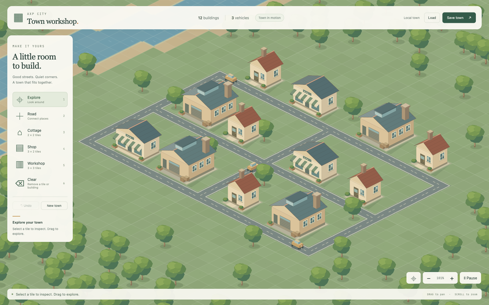

# Core city engine

This implementation replaces the live presentation's overlapping terrain, civic stamps and decorative actor rules with one bounded world. Phaser remains the renderer. Existing integration code and persisted repository data are preserved; they are not inputs to the workshop.

## Spatial contract

Version 1 is a 64×64 map with integer origin (-32,-32), explicit flat elevation 0, and one terrain value per cell. Road presence and building occupancy are separate fields. Seeded, continuous river/lake geometry replaces independently scattered water cells. North/east/south/west neighbor masks select matching road and shore edges, including chunk boundaries.

Cottage (2×2), shop (3×2) and workshop (3×3) definitions declare footprint and entrance coordinates. Placement requires dry, unoccupied cells and an adjacent road at the entrance. The same command validator drives the preview and the committed change. Failed commands are atomic. Roads must connect to the existing graph; deletion may not strand buildings, split the network or remove a vehicle's reserved endpoints.

Projection is 72×36 pixels per tile. Art declares logical dimensions, ground anchors, footprints and lighting. A building's roof, walls and attachments share one texture and one ground-based depth. Zoom never changes object world size. Ground chunks are baked once, culled by the camera and regenerated only near edited cells. Buildings/trees reuse pooled images. Inspect/Clear picks the topmost opaque building sprite before falling back to the ground cell, so visible roof clicks select the building.

## Simulation contract

The authoritative state contains cells, entities, IDs, routes, edge reservations, tick and sub-tick remainder. It contains no sprites, browser state or camera coordinates.

A fixed 100ms tick advances vehicles along a connected road graph. Both endpoints of an in-flight edge remain reserved. Vehicles cannot occupy the same tile or swap head-on. Blocked routes are recomputed deterministically. Sub-tick interpolation smooths drawing without changing the simulation. Equal total elapsed time yields equal complete state across frame partitions, including fractional 60Hz/144Hz frames. Camera visibility does not create entities or change their clock.

Visible-time stalls are processed as fixed ticks without silently dropping time. Paused or hidden tabs do not accrue simulation time. This is a small transport kernel, not an economic simulation or rigid-body physics system.

## Persistence and runtime boundary

`serializeWorld` and `deserializeWorld` validate version, dimensions, integer coordinates, terrain, occupancy, connectivity, unique identities, ID allocation, vehicle spacing, routes and clock fields. Unknown versions and malformed saves fail explicitly. The complete browser save lives at `axp-core-world-v1`. Loading validates before replacing the open town; malformed saved data is preserved and explained. Undo keeps a bounded 30-edit history, separate from the saved copy.

`npm start`, `npm run dev`, `npm run preview` and the service launcher default to `--core`. The core server serves one Phaser client plus health/readiness. It does not open SQLite, hydrate fixtures, borrow credentials, poll GitHub, start webhook workers or expose legacy API data. The preserved integration service requires an explicit alternate invocation. Old addresses are not silently reinterpreted using new grid units.

## Scope kept small

Included: three buildings, one vehicle type, coherent grass/dirt/water, roads, placement/clear, inspection, camera, pause, undo and browser save/load. Deferred: repository enrollment in this map, shared/cloud saves, economic systems, slopes, bridges, trams, drones, civic collages, weather, elaborate HUD and export features.

The old renderer files and historical image pipeline remain as archival source. They are not imported into the active client bundle. The new art is authored procedurally in one source file with no external source-image dependency.

## Acceptance evidence

The current CI uses standard pytest-playwright fixtures and the same functional suite in all three browser jobs, following [Streamlit](https://github.com/streamlit/streamlit/blob/a807ca5f8274de0eb708729cb40266f6321b82cc/.github/workflows/playwright.yml#L27-L29). Browser versions are pinned; the custom hosted/local launcher is removed. Timing benchmarks are explicit local measurements and do not gate pull requests. [Commands and failure artifacts](../e2e/README.md).

The core unit suite covers connected terrain, all road/shores masks, legal/illegal footprints and entrances, routing, vehicle separation over time, equal outcomes across frame partitions, mid-edge save continuation, consecutive normal-traffic save validation, and malformed-save cases. Browser acceptance drives actual controls under the production CSP and inspects resulting world state and rendered screenshots. It covers native touch, near/mid/far views, invalid-save preservation, Canvas fallback, bounded travel resources and graphics-context recovery. Existing backend operations tests verify the preserved store remains usable.

Historical UI suites are explicitly excluded as superseded presentation checks; they are not reported as passing. Source-only checks that required the former search box, page title or startup command were retired. The load-test heap budget remains 64MiB but now samples retained heap after garbage collection and consumes response bodies, rather than confusing uncollected allocations with retained state.

Performance reports name driver, host, resolution, map size and scenario. SwiftShader is software correctness evidence. Physical phones and Apple's Safari are not implied by Playwright touch emulation or WebKit. Reproducible commands are in [browser verification](../e2e/README.md).

### Recorded local acceptance, 2026-09-19

- 192 unit/service/backend checks; TypeScript checks and production build.
- Final combined Chromium suite: 19 checks including the populated-world benchmark; 32 historical UI checks explicitly deselected.
- Firefox and WebKit: 11 core checks each, with the Chromium-specific native-touch case explicitly skipped; all three subsequently added drag/shortcut regressions also passed on each engine.
- Separate verified Metal hardware profile: one passing populated-world benchmark.
- Actual core service verifier: health/readiness and expected revision, all five lazy/static assets, seven security headers, cache policies, six absent integration endpoints and four rejected mutation requests.
- Retained backend load-test heap growth: 4.4 MiB after collection, within the unchanged 64 MiB bound.

The populated benchmark ran Chromium 149.0.7827.55 at 1600×1000, DPR 1, on a 64×64 map with 96 buildings and 20 vehicles. Each scenario sampled 180 frame intervals. The hardware driver was ANGLE Metal on Apple M5 Max; the separate software run reported SwiftShader.

| p95 frame interval | Idle | Pan | Zoom | Editing |
|---|---:|---:|---:|---:|
| Apple M5 Max / Metal | 10.0 ms | 9.9 ms | 9.9 ms | 10.0 ms |
| SwiftShader software | 41.7 ms | 58.4 ms | 48.5 ms | 50.0 ms |

Hardware passed the 16.7ms p95 target. The final hardware run peaked at 10.3ms; an earlier run observed a 58.5ms interval during panning, so this is not a claim of zero dropped frames. Across eight travel checkpoints the populated scene stayed at 485 objects, 76 textures and 64 chunks. The software profile demonstrates bounded correctness, not 60fps performance. These are short local runs, not a long-duration soak or production measurement.

[Hardware measurements](evidence/core-metal.json) · [Software measurements](evidence/core-software.json)

### Browser harness simplification, 2026-09-20

Local verification after adopting standard pytest-playwright fixtures: 190 unit/service checks, typecheck/build, three backend operations checks, and the single three-browser invocation (41 passed, two Chromium-only touch cases skipped on the other engines). All existing core behavioral assertions remain. Two source-text tests that required the removed bespoke harness were retired. The explicit Metal benchmark command also passed; the benchmark is excluded from normal collection and required CI.
